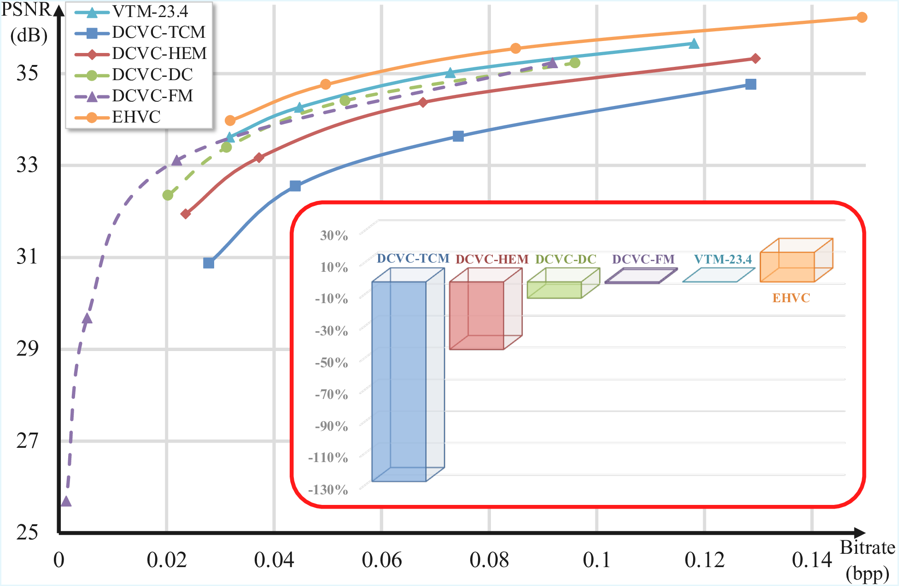
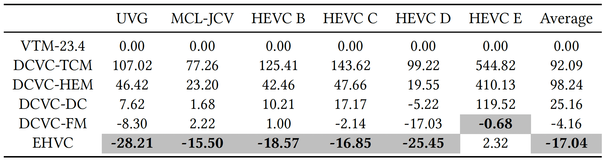

<!-- Copyright 2025 ByteDance Ltd. and/or its affiliates.
All rights reserved.
Licensed under the BSD 3-Clause Clear License (the "License");
you may not use this file except in compliance with the License.
You may obtain a copy of the License at
https://choosealicense.com/licenses/bsd-3-clause-clear/
Unless required by applicable law or agreed to in writing, software
distributed under the License is distributed on an "AS IS" BASIS,
WITHOUT WARRANTIES OR CONDITIONS OF ANY KIND, either express or implied.
See the License for the specific language governing permissions and
limitations under the License.

Redistribution and use in source and binary forms, with or without
modification, are permitted (subject to the limitations in the disclaimer
below) provided that the following conditions are met:

* Redistributions of source code must retain the above copyright notice,
this list of conditions and the following disclaimer.
* Redistributions in binary form must reproduce the above copyright notice,
this list of conditions and the following disclaimer in the documentation
and/or other materials provided with the distribution.
* Neither the name of ByteDance Ltd. and/or its affiliates Communications, Inc nor the names of its
contributors may be used to endorse or promote products derived from this
software without specific prior written permission.

NO EXPRESS OR IMPLIED LICENSES TO ANY PARTY'S PATENT RIGHTS ARE GRANTED BY
THIS LICENSE. THIS SOFTWARE IS PROVIDED BY THE COPYRIGHT HOLDERS AND
CONTRIBUTORS "AS IS" AND ANY EXPRESS OR IMPLIED WARRANTIES, INCLUDING, BUT
NOT LIMITED TO, THE IMPLIED WARRANTIES OF MERCHANTABILITY AND FITNESS FOR A
PARTICULAR PURPOSE ARE DISCLAIMED. IN NO EVENT SHALL THE COPYRIGHT HOLDER OR
CONTRIBUTORS BE LIABLE FOR ANY DIRECT, INDIRECT, INCIDENTAL, SPECIAL,
EXEMPLARY, OR CONSEQUENTIAL DAMAGES (INCLUDING, BUT NOT LIMITED TO,
PROCUREMENT OF SUBSTITUTE GOODS OR SERVICES; LOSS OF USE, DATA, OR PROFITS;
OR BUSINESS INTERRUPTION) HOWEVER CAUSED AND ON ANY THEORY OF LIABILITY,
WHETHER IN CONTRACT, STRICT LIABILITY, OR TORT (INCLUDING NEGLIGENCE OR
OTHERWISE) ARISING IN ANY WAY OUT OF THE USE OF THIS SOFTWARE, EVEN IF
ADVISED OF THE POSSIBILITY OF SUCH DAMAGE. -->

<div align="center">

# **NEVC-1.0** <br>(EHVC: Efficient Hierarchical Reference and Quality Structure for Neural Video Coding)


<div align="center">

<div>

<div align="left">

## :memo: Introduction
Welcome to the official **NEVC-1.0** repository. This repository features the first release **NEVC-1.0**, which includes contribution from the **EHVC (Efficient Hierarchical Reference and Quality Structure for Neural Video Coding)**, one of the core components of the framework. **EHVC** introduces innovative hierarchical reference and quality structures that provide substantial improvements in both performance and compression efficiency.

The key designs in **EHVC** include:
- **Hierarchical multi-reference:** Efficiently addressing reference-quality mismatches through a hierarchical reference structure and a corresponding multi-reference scheme, optimized for low-delay configurations.
- **Lookahead mechanism:** Enriching the encoder-side context with forward features to enhance prediction accuracy and compression.
- **Layer-wise quantization scale with random quality training:** A flexible and efficient quality structure that adapts during training for improved encoding performance.

---

## :computer: Prerequisites
- **Python 3.11** and **conda**
- **CUDA** (if you wish to use GPU)

### Environment Setup
```shell
conda create -n $YOUR_ENV_NAME python=3.11
conda activate $YOUR_ENV_NAME

conda install pytorch==2.3.1 torchvision==0.18.1 torchaudio==2.3.1 pytorch-cuda=12.1 -c pytorch -c nvidia

pip install -r requirements.txt
```

## :file_folder: Test dataset
The dataset structure can be seen in cfg/dataset_config_rgb_allF_IP-1.json.

The folder structure of test dataset is like:

```
testset_root_path/
    ├── HEVC_B/
    │   ├── BQTerrace_1920x1080_60/
    │   │   ├── im00001.png
    │   │   ├── im00002.png
    │   │   ├── im00003.png
    │   │   └── ...
    │   ├── BasketballDrive_1920x1080_50/
    │   │   ├── im00001.png
    │   │   ├── im00002.png
    │   │   ├── im00003.png
    │   │   └── ...
    │   └── ...
    ├── HEVC_C/
    │   └── ...
    └── HEVC_D/
        └── ...
```

Replace `testset_root_path` in cfg/dataset_config_rgb_allF_IP-1.json and cfg/dataset_config_rgb_96F_IP32.json with the root path of your test dataset.

## :wrench: Build the project
- Set the working directory to `NEVC-1.0-EHVC`.
- Build the project by running:
```shell
sh ./build_entropy.sh
```

## :floppy_disk: Get the pretrained model
- EHVC uses the same **intra model** as DCVC-DC, which can be downloaded from [DCVC-DC](https://github.com/microsoft/DCVC/tree/main/DCVC-family/DCVC-DC).
- Our **inter model** can be downloaded from [EHVC](https://huggingface.co/ByteDance/NEVC1.0). Our **intra model** is also available here.

 ## :test_tube: Test the model
 - Set the working directory to `NEVC-1.0-EHVC`.
 - Specify the output json path in the test script (output_path).
 - Specify the stream path in the test script (stream_path).
 - For 96 frames with intra-period 32, run:

```shell
sh ./test_video_F96_G32.sh ./checkpoints/EHVC_intra_model.pth ./checkpoints/EHVC_inter_model.pth.tar
```

 - For all frames with intra-period -1, run:

```shell
sh ./test_video_Fall_G-1.sh ./checkpoints/EHVC_intra_model.pth ./checkpoints/EHVC_inter_model.pth.tar
```


## :bar_chart: Experimental results
### Objective comparison
<div align="center">
BD-Rate (%) comparison for PSNR. The anchor is VTM-23.4 LDB. All codecs are under 96 frames with intra-period 32.<br>


Rate-Distortion curves on HEVC B, HEVC C, UVG, and MCL-JCV dataset. The intra-period is 32 with 96 frames.<br>


BD-Rate (%) comparison for PSNR. The anchor is VTM-23.4 LDB. All codecs are under all frames with intra-period -1.<br>



Rate-Distortion curves on HEVC B, HEVC C, UVG, and MCL-JCV dataset. The intra-period is -1 with all frames.<br>


</div>

## :scroll: Citation

If you find **NEVC 1.0** helpful in your research or projects, we kindly ask you to consider citing the following paper:

- **EHVC: Efficient Hierarchical Reference and Quality Structure for Neural Video Coding**  
  Junqi Liao, Yaojun Wu, Chaoyi Lin, Zhipin Deng, Li Li, Dong Liu, Xiaoyan Sun, ACM MM 2025.  
  ```bibtex
  @inproceedings{liao2025ehvc,
    title={EHVC: Efficient Hierarchical Reference and Quality Structure for Neural Video Coding},
    author={Liao, Junqi and Wu, Yaojun and Lin, Chaoyi and Deng, Zhipin and Li, Li and Liu, Dong and Sun, Xiaoyan},
    booktitle={Proceedings of the 33rd ACM International Conference on Multimedia},
    year={2025}
  }
## :handshake: Acknowledgement
Our work is implemented based on [CompressAI](https://github.com/InterDigitalInc/CompressAI) and [DCVC-DC](https://github.com/microsoft/DCVC/tree/main/DCVC-family/DCVC-DC).
